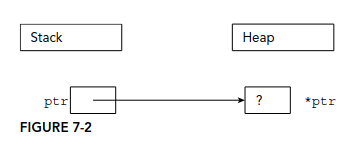
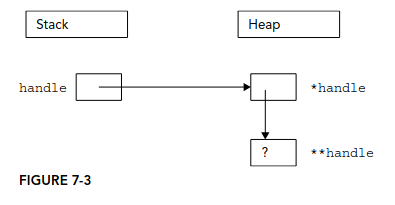

## Chapter 7: Memory Management

- Different ways to use and manage memory
- The often-perplexing relationship between arrays and pointers
- A low-level look at working with memory
- Smart pointers and how to use them
- Solutions to a few memory-related problems

```cpp
int i = 7;
```

`i` is a so-called _automatic variable_ allocated on the stack. It is automatically deallocated when the program flow leaves the scope in which the variable is declared. 

When you use the `new` keyword, memory is allocated on the heap. The following code creates a variable `ptr` on the stack initialized with `nullptr`, and then allocates memory on the heap to which `ptr` points:

```cpp
int* ptr = nullptr;
ptr = new int;
```

This can also be written as a one-liner:

```cpp
int* ptr = new int;
```

Notice that the variable `ptr` is still on the stack even though it points to memory on the heap. A pointer is just a variable and can live on either the stack or the heap, although this fact is easy to forget. Dynamic memory, however, is always allocated on the heap.



As a rule of thumb, every time you declare a pointer variable, you should immediately initialize it with either a proper pointer or `nullptr`. Don't leave it uninitialized!

The next example shows that pointers can exist both on the stack and on the heap:

```cpp
int** handle = nullptr;
handle = new int*;
*handle = new int;
```

The preceding code first declares a pointer to a pointer to an integer as the variable ``handle`. It then dynamically allocates enough memory to hold a pointer to an integer, storing the pointer to that new memory in `handle`. Next, that memory (`*handle`) is assigned a pointer to another section of dynamic memory that is big enough to hold the integer. 



To create space for a variable, you use the `new` keyword. To release that space for use by other parts of the program, you use the `delete` keyword.

When you want to allocate a block of memory, you call `new` with the type of variable for which you need space. `new` returns a pointer to that memory, although it is up to you to store that pointer in a variable. If you ignore the return value of `new`, or if the pointer variable goes out of scope, the memory becomes _orphaned_ because you no longer have a way to access it. This is also called a _memory leak_.

For example, the following code orphans enough memory to hold an `int`. 

```cpp
void leaky()
{
    new int;
}
```

To free memory on the heap, you use the `delete` keyword with a pointer to the memory, as shown here:

```cpp
int* ptr = new int;
delete ptr;
ptr = nullptr;
```

It is recommended to set a pointer back to `nullptr` after having freed its memory. That way, you do not accidentally use a pointer to memory that has already been allocated. 

In C, `malloc()` is used to allocate a given number of bytes of memory. For the most part, using `malloc()` is simple and straightforward. The `malloc()` still exists in C++, but you should avoid it. The main advantage of `new` over `malloc()` is that `new` doesn't just allocate memory, it constructs objects!

For example, consider the following two lines of code, which use a hypothetical class called `Foo`:

```cpp
Foo* myFoo = (Foo*)malloc(sizeof(Foo));
Foo* myOtherFoo = new Foo();
```

After executing these lines, both `myFoo` and `myOtherFoo` will point to areas of memory on the heap that are big enough for a `Foo` object. Data members and methods of `Foo` can be accessed using both pointers. The difference is that the `Foo` object pointed to by `myFoo` isn't a proper object because it was never constructed. The `malloc()` function only sets aside a piece of memory of a certain size. It doesn't know or care about objects. In contrast, the call to `new` allocates the appropriate size of memory and also calls an appropriate constructor to construct the object. 

A similar difference exists between the `free()` function and the `delete` operator. With `free()`, the object's destructor is not called. With `delete`, the destructor is called and the object is properly cleaned up. 

Declaring arrays on the heap is no different, except that you use a pointer to refer to the location of the array. The following code allocates memory for an array of five `int`s and stores a pointer to the memory in a variable called myArrayPtr:

```cpp
int * myArrayPtr = new int[5];
```

Each call to `new[]` should be paired with a call to `delete[]` to clean up the memory. For example:

```cpp
delete [] myArrayPtr;
myArrayPtr = nullptr;
```

```cpp
Document* createDocArray()
{
    size_t numDocs = askUserNumberOfDocuments();
    Document* docArray = new Document[numDocs];
    return docArray;
}
```

Remember that each call to `new[]` should be paired with a call to `delete[]`, so in this example, it's important that the called of `createDocArray()` uses `delete[]` to cleanup the returned memory. Another problem is that C-style arrays don't know their size; thus callers of `createDocArray()` have no idea how many elements there are in the returned array!

In the preceding function, `docArray` is a dynamically allocated array. Do not get this confused with a _dynamic array_. The array itself is not dynamic because it's size does not change once it is allocated. 

**Casting with Pointers**

Because pointers are just memory addresses (or arrows to somewhere), they are somewhat weakly typed. A pointer to an XML document is the same size as a pointer to an integer. The compiler will let you easily cast any pointer type to any other other pointer type using C-style cast:

```cpp
Document* documentPtr = getDocument();
char* myCharPtr = (char*)documentPtr;
```

A _static cast_ offers a bit more safety. The compiler refuses to perform a static cast on pointers to unrelated data types:

```cpp
Document* documentPtr = getDocument();
char* myCharPtr = static_cast<char*>(documentPtr); // BUG wont't compile
```

If the two pointers you are casting are actually pointing to objects that are related through inheritance, the compiler will permit a static cast. However, a `dynamic_cast` is a safer way to accomplish a cast within an inheritance hierarchy. 

There is a way to pass known-length stack-based arrays "by reference" to a function. This does not work for heap-based arrays. For example, the following `doubleIntsStack()` accepts only stack-based arrays of size 4:

```cpp
void doubleIntsStack(int (&theArray) [4]);
```

A function template, can be used to let the compiler deduce the size of the stack-based array automatically:

```cpp
template<size_t N>
void doubleIntsStack(int (&theArray)[N]) {
    for (size_t i = 0; i < N; i++) {
        theArray[i] *=2;
    }
}
```

Pointers and arrays share many properties and can sometimes be used interchangeably, but they are not the same. Arrays are automatically referenced as pointers, but not all pointers are arrays.

You default smart pointer should be `unique_ptr`. Only use `shared_ptr` when you really need to share the resource.

```cpp
void notLeaky()
{
    auto mySimpleSmartPtr = make_unique<Simple>();
    mySimpleSmartPtr->go();
}
```

This code uses `make_unique()`, in combination with the `auto` keyword, so that you only have to specify the type of the pointer, `Simple` in this case, once. If the `Simple` constructor requires parameters, you put them in between the parentheses of the `make_unique()` call.

Always use `make_unique()` to create a `unique_ptr`.

The `get()` method can be used to get direct access to the underlying pointer. This can be useful to pass the pointer to a function that requires a dumb pointer. 

```cpp
void processData(Simple* simple) {}
```

Then you can call it as follows:

```cpp
auto mySimpleSmartPtr = make_unique<Simple>();
processData(mySimpleSmartPtr.get());
```

You can free the underlying pointer of a `unique_ptr` and optionally change it to another pointer using `reset()`.

```cpp
mySimpleSmartPtr.reset(); // Free resource and set to nullptr
mySimpleSmartPtr.reset(new Simple()); // Free resource and set to a new Simple instance
```

You can disconnect the underlying pointer from a `unique_ptr` with `release()`. The `release()` method returns the underlying pointer to the resource and then sets the smart pointer to `nullptr`. Effectively, the smart pointer loses ownership of the resource, and as such, you become responsible for freeing the resource when you are done with it. 

```cpp
Simple* simple = mySimpleSmartPtr.release(); // Release ownership
// Use the simple pointer...
delete simple;
simple = nullptr;
```

Because a `unique_ptr` represents unique ownership, it cannot be _copied_! Using the `std::move()`, it is possible to _move_ one `unique_ptr` to another one using move semantics. 

```cpp
class Foo
{
    public:
        Foo(unique_ptr<int> data) : mData(move(data)) { }
    private:
        unique_ptr<int> mData;
};

auto myIntSmartPtr = make_unique<int>(42);
Foo f(move(myIntSmartPtr));
```

**Custom deleters**

By default, `unique_ptr` uses the standard `new` and `delete` operators to allocate and deallocate memory. You can change this behaviour as follows:

```cpp
int* malloc_int(int value)
{
    int* p = (int*)malloc(sizeof(int));
    *p = value;
    return p;
}
int main()
{
    unique_ptr<int, decltype(free)*> myIntSmartPtr(malloc_int(42), free);
    return 0;
}
```

Unfortunately, the syntax for a custom deleter with `unique_ptr` is a bit clumsy.

**shared_ptr**

Just like `unique_ptr`, `shared_ptr` by default uses the standard `new` and `delete` operators to allocate and deallocate memory, or `new[]` and `delete[]` when storing a C-style array. You can change this behaviour as follows:

```cpp
// Implementation of malloc_int() as before.
shared_ptr<int> myIntSmartPtr(malloc_int(42), free);
```

The following example uses a `shared_ptr` to store a file pointer. When the `shared_ptr` is reset (in this case when it goes out of scope), the file pointer is automatically closed with a call to `CloseFile()`. 

```cpp
void CloseFile(FILE* filePtr)
{
    if (filePtr == nullptr)
        return;
    fclose(filePtr);
    cout << "File closed." << endl;
}
int main()
{
    FILE* f = fopen("data.txt", "w");
    shared_ptr<FILE> filePtr(f, CloseFile);
    if (filePtr == nullptr) {
        cerr << "Error opening file." << endl;
    } else {
        cout << "File opened." << endl;
        // Use filePtr
    }
    return 0;
}
```

```cpp
void doubleDelete()
{
    Simple* mySimple = new Simple();
    shared_ptr<Simple> smartPtr1(mySimple);
    shared_ptr<Simple> smartPtr2(mySimple);
}
```

Depending on your compiler, this piece of code might crash! If you do get output, it could be as follows:

```
Simple constructor called!
Simple destructor called!
Simple destructor called!
```

You might be surprised that even the reference-counted `shared_ptr` class behaves this way. You should not use `shared_ptr` as in the previous `doubleDelete()` function to create two `shared_ptr`s pointing to the same object. Instead, you should make a _copy_ as follows:

```cpp
void noDoubleDelete()
{
    auto smartPtr1 = make_shared<Simple>();
    shared_ptr<Simple> smartPtr2(smartPtr1);
}
```

A `shared_ptr` support so-called `aliasing`. This allows a `shared_ptr` to share ownership over a pointer (owned pointer) with another `shared_ptr`, but pointing to a different object (stored pointer). It can, for example, be used to have a `shared_ptr` pointing to a member of an object while owning the object itself. Here's an example:

```cpp
class Foo
{
    public:
        Foo(int value) : mData(value) { }
        int mData;
};

auto foo = make_shared<Foo>(42);
auto aliasing = shared_ptr<int>(foo, &foo->mData);
```

The `Foo` object is only destroyed when both `shared_ptr`s (`foo` and `aliasing`) are destroyed.

**weak_ptr**

A `weak_ptr` can contain a reference to a resource managed by a `shared_ptr`. The `weak_ptr` does not own the resource, so the `shared_ptr` is prevented from deallocating the resource. A `weak_ptr` does not destroy the pointed-to resource when the `weak_ptr` is destroyed (for example when it goes out of scope); however, it can be used to determine if the resource has been freed by the associated `shared_ptr` or not. To get access to the pointer stored in the a `weak_ptr`, you need to convert it to a `shared_ptr`. There are two ways to do this:

- Use the `lock()` method on a `weak_ptr` instance, which returns a `shared_ptr`. The returned `shared_ptr` is `nullptr` if the `shared_ptr` associated with the `weak_ptr` has been deallocated in the meantime. 
- Create a new `shared_ptr` instance and give a `weak_ptr` as argument to the `shared_ptr` constructor. This throws an `std::bad_weak_ptr` exception if the `shared_ptr` associated with the `weak_ptr` has been deallocated.

